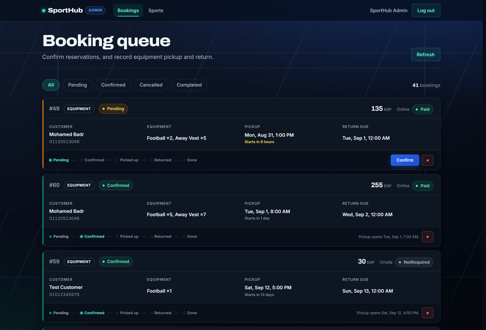
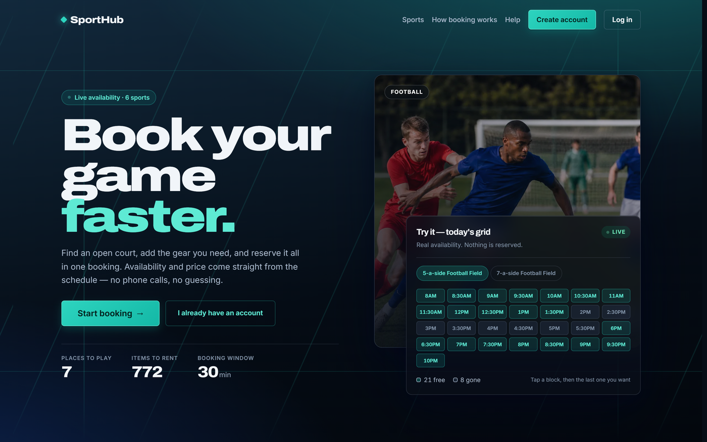
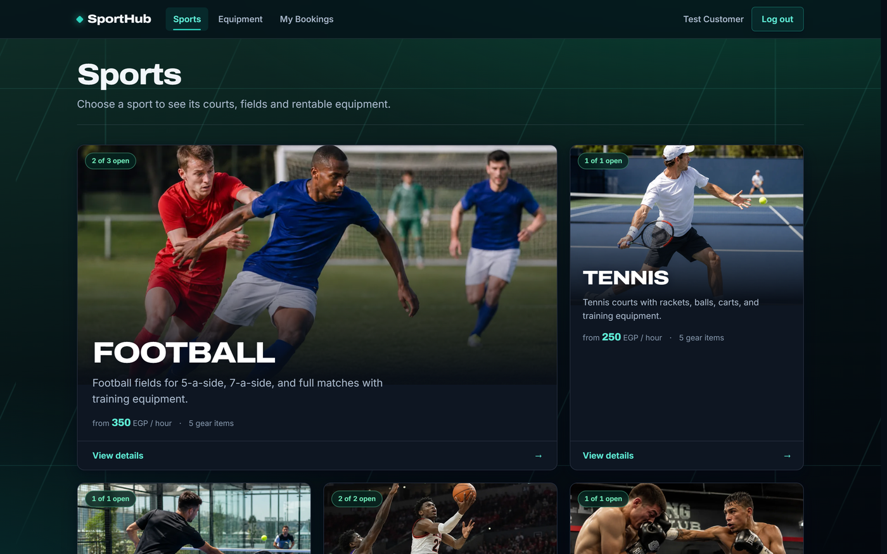
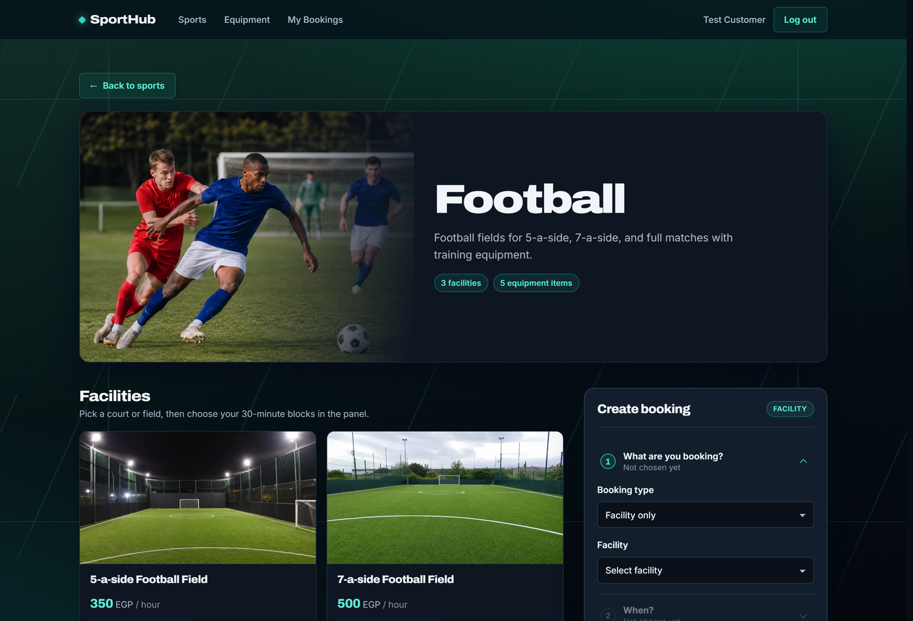
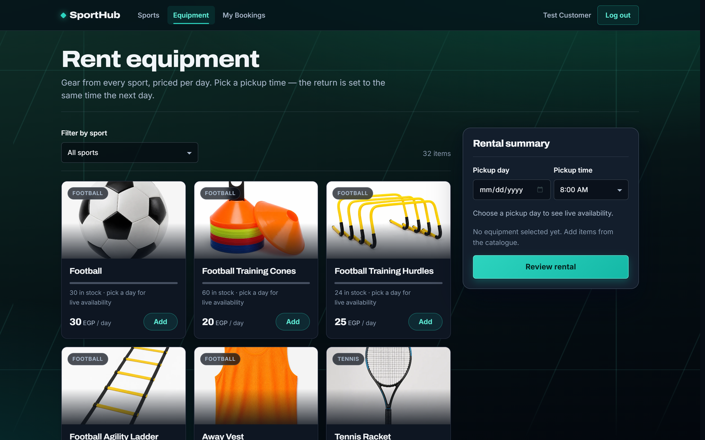
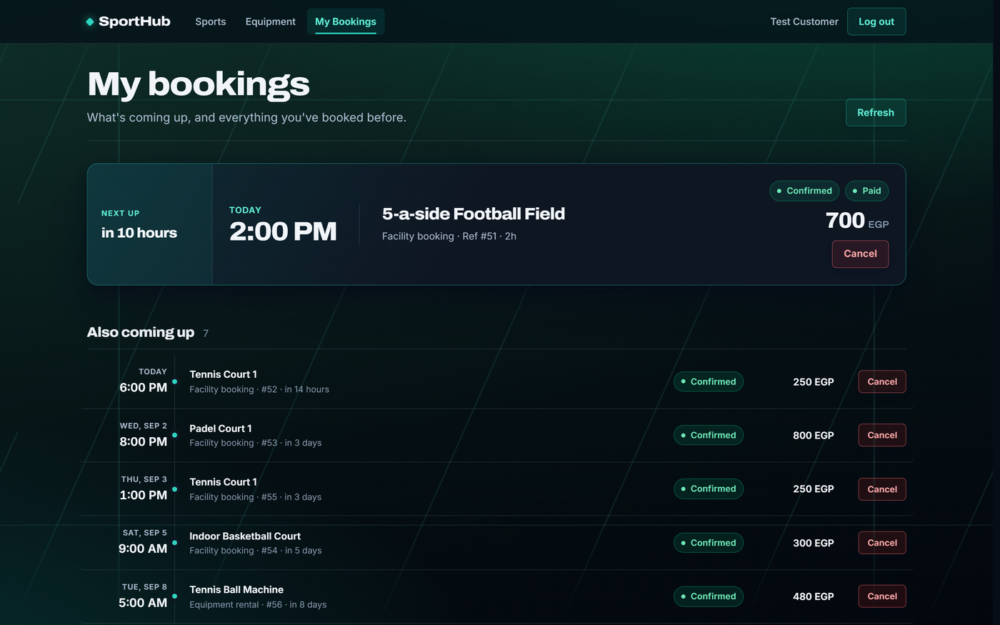
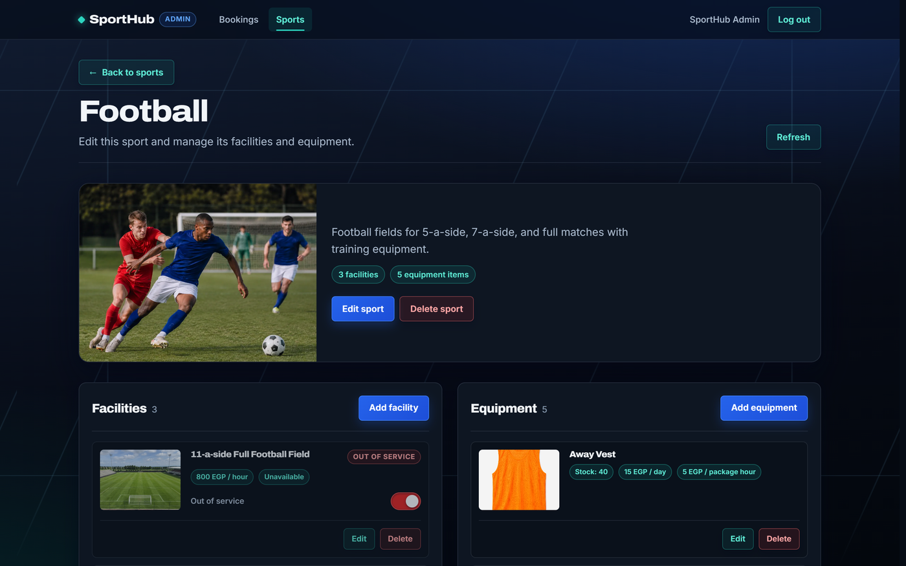
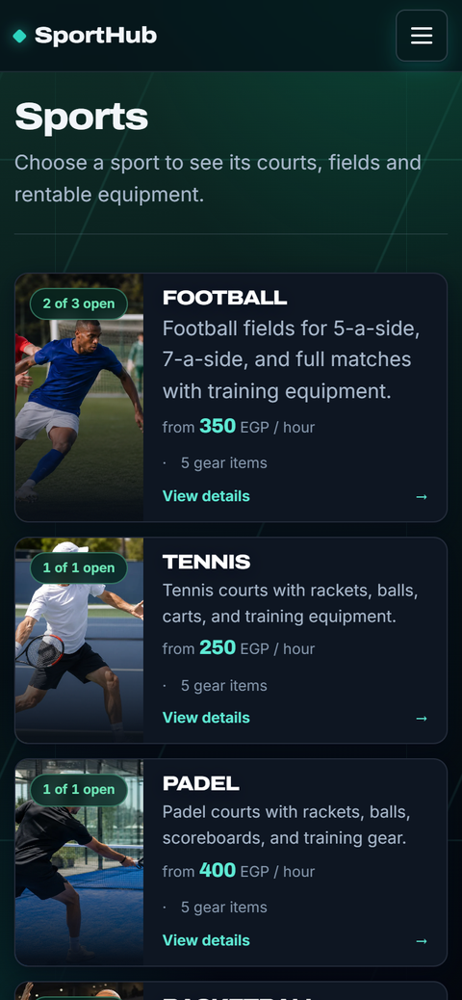
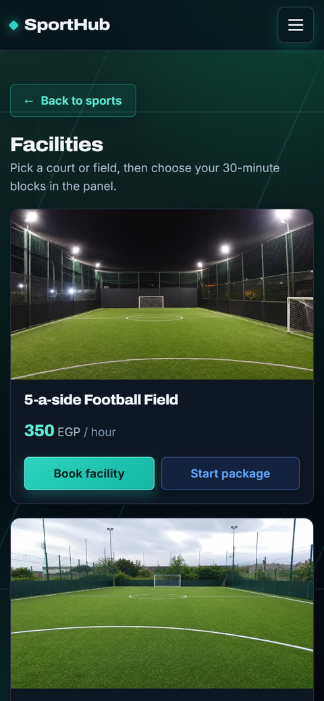
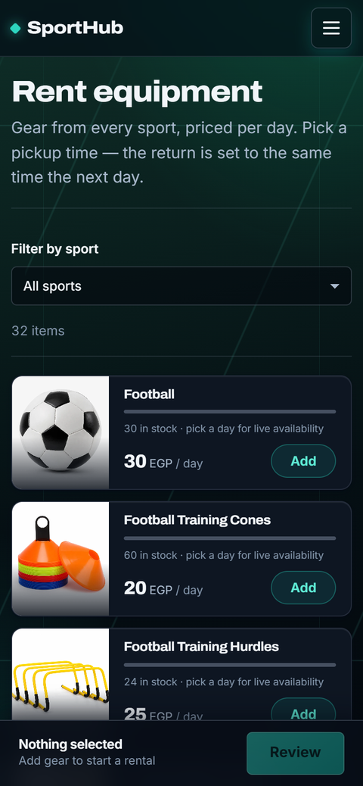

# SportHub 🏟️

> A sports facility booking and equipment rental platform — built to demonstrate REST API design, business-rule enforcement in the backend, and a QA process with real defect tracking.


---

## What is SportHub?

SportHub lets a customer reserve a court or field in 30-minute blocks, rent equipment by the day, or book both together as a package. Staff work a booking queue: confirming reservations, handing gear over, recording returns, and closing bookings out.

The interesting part is not the CRUD. It is that the rules are real and enforced on the server — a booking cannot be completed before the time it reserved has elapsed, equipment cannot leave the counter days early or for a reservation nobody confirmed, and the cancellation window is exactly two hours in the venue's local time. Several of those rules exist because testing found them missing.



---

## Screenshots

Captured from the running app. These are downscaled for the README; full-resolution 2× originals are kept with the project's QA evidence, outside the repository.

### The front door

The landing page shows live availability from the real catalogue, and its 30-minute grid is the same interaction used to book.



### Browsing and booking

<table>
<tr>
<td width="50%"></td>
<td width="50%"></td>
</tr>
<tr>
<td align="center"><em>Every sport, with live facility and gear counts</em></td>
<td align="center"><em>Pick a facility, then the first and last 30-minute block — the range must be free end to end</em></td>
</tr>
</table>

### Renting gear, and looking back

<table>
<tr>
<td width="50%"></td>
<td width="50%"></td>
</tr>
<tr>
<td align="center"><em>Stock is checked against the exact rental period, not a static count</em></td>
<td align="center"><em>The next booking leads; everything else is grouped by when it happens</em></td>
</tr>
</table>

### Staff view

Each booking is one record: who it is for, what it is, when, what it costs, where it has got to, and what can be done to it next. When an action is withheld, the record says why — "Runs until Mon, Aug 31, 6:00 PM" rather than a missing button.



### On a phone

Booking runs as its own full-page flow with a real route, so the phone's back button behaves and a refresh does not lose the step.

<table>
<tr>
<td width="33%"></td>
<td width="33%"></td>
<td width="33%"></td>
</tr>
<tr>
<td align="center"><em>Rows, not posters — several per screen</em></td>
<td align="center"><em>Facilities lead; the booking panel appears only when asked for</em></td>
<td align="center"><em>A sticky bar carries the running total and the next step</em></td>
</tr>
</table>

---

## Features

- **Accounts and role separation** — customers and administrators, split by route guards on the client and `[Authorize(Roles = ...)]` on the API
- **30-minute slot booking** — pick the first block and the last; the range must be free end to end, and occupied blocks are shown as such
- **Package booking** — a facility plus gear, priced per hour across the booked duration
- **Equipment rental** — priced per day, returned at the same time the next day, with stock checked against the exact period
- **Live availability** — facility slots and equipment stock come from real reservations, not a static count
- **Two-hour cancellation window** — enforced against the venue's local time, not the server's UTC clock
- **Booking lifecycle** — Pending → Confirmed → Picked up → Returned → Done, each transition gated on the server
- **Administrator booking queue** — filter by status, page through, and confirm, hand over, receive and complete
- **Guarded actions** — every state change asks first, states what will happen, and cannot be double-submitted
- **Asset management** — administrators create and edit sports, facilities and equipment, and upload photographs
- **Online or on-site payment** — a demo checkout for online, or payment recorded at the counter
- **WebP image delivery** — transparent content negotiation with long-lived caching, cutting catalogue payloads by ~95%

---

## Tech stack

| Layer | Technology |
|---|---|
| Backend API | ASP.NET Core 8 Web API, Entity Framework Core 8 |
| Database | MySQL 8 (Pomelo EF Core provider) |
| Authentication | JWT Bearer, BCrypt password hashing |
| Frontend | Angular 19 (standalone components, signals, `@if`/`@for`) |
| Styling | Hand-written CSS with design tokens, no UI framework |
| Image delivery | WebP content negotiation, `Cache-Control: immutable` |
| Test management | Zephyr (90 manual cases, executed in cycles) |
| Defect tracking | Jira (`SPOR`) |
| API testing | Postman collection |

---

## Architecture

```
┌────────────────────┐         ┌──────────────────────┐
│  Angular 19 SPA     │◄───────►│  ASP.NET Core 8 API  │
│  (port 4200)        │  JWT    │  (port 5165)         │
└────────────────────┘         └──────────┬───────────┘
                                           │ EF Core
                                ┌──────────▼───────────┐
                                │      MySQL 8          │
                                │  - Users              │
                                │  - Sports             │
                                │  - Facilities         │
                                │  - Equipment          │
                                │  - Bookings           │
                                │  - BookingEquipment   │
                                │  - Payments           │
                                └──────────────────────┘

                                ┌──────────────────────┐
                                │  wwwroot/uploads/     │
                                │  originals + .webp    │
                                │  served with          │
                                │  Vary: Accept         │
                                └──────────────────────┘
```

Business rules live in the controllers, not the client. The Angular gates mirror them so the UI never offers an action the API will reject — but the API is the authority, and every rule is tested directly against it.

---

## Project structure

```
SportsHub/
├── SportHub.Api/                             # ASP.NET Core Web API
│   ├── Controllers/
│   │   ├── AuthController.cs                 # Register, login, JWT issuing, password policy
│   │   ├── SportsController.cs               # Public catalogue
│   │   ├── BookingsController.cs             # Customer bookings, availability, cancellation
│   │   ├── AdminBookingsController.cs        # Booking queue, lifecycle transitions
│   │   ├── AdminSportsController.cs          # Sport / facility / equipment management
│   │   ├── AdminUploadsController.cs         # Image upload, GUID-named files
│   │   └── PaymentsController.cs             # Demo online checkout
│   ├── Data/                                 # DbContext and seeding
│   ├── DTOs/                                 # Request and response shapes
│   ├── Models/                               # Entities and enums
│   ├── Migrations/                           # EF Core migrations
│   ├── wwwroot/uploads/                      # Seeded and uploaded images (+ WebP siblings)
│   ├── Program.cs                            # Pipeline, WebP negotiation, static-file caching
│   └── appsettings.Development.json
│
├── SportHub.Client/                          # Angular 19 SPA
│   └── src/app/
│       ├── core/
│       │   ├── guards/                       # authGuard, adminGuard
│       │   ├── interceptors/                 # Attaches the bearer token
│       │   └── services/                     # api.config, auth, sports, booking, admin
│       ├── models/                           # Typed API contracts
│       ├── pages/
│       │   ├── home/                         # Landing page with live availability
│       │   ├── auth/                         # Combined sign in / create account
│       │   ├── sports/                       # Catalogue
│       │   ├── sport-details/                # Facilities, gear, booking flow
│       │   ├── equipment-booking/            # Rental catalogue and summary
│       │   ├── bookings/                     # My bookings timeline
│       │   ├── payment/                      # Demo checkout
│       │   └── admin/                        # Booking queue and asset management
│       ├── shared/                           # Navbar, quantity stepper, reveal directive
│       └── app.routes.ts
│
├── assets/screenshots/                        # Product screenshots used in this README
└── Docs/                                      # QA artefacts, kept outside version control
    ├── SportHub_Zephyr_Manual_Test_Suite.md   # The manual test suite, source of truth
    └── QA-Evidence/                           # Execution records, measurements, before/after
```

---

## Getting started

### Prerequisites

- [.NET 8 SDK](https://dotnet.microsoft.com/download)
- [Node.js 20+](https://nodejs.org/)
- MySQL 8 running locally

### 1. Clone

```bash
git clone https://github.com/Badr029/SportsHub.git
cd SportsHub
```

### 2. Configure the database

Set the connection string in `SportHub.Api/appsettings.Development.json`:

```json
{
  "ConnectionStrings": {
    "DefaultConnection": "server=localhost;port=3306;database=sporthub_db;user=root;password=your_password"
  },
  "Jwt": {
    "Key": "replace_me_with_a_long_random_string",
    "Issuer": "SportHub",
    "Audience": "SportHubUsers"
  }
}
```

### 3. Run the API

```bash
cd SportHub.Api
dotnet run --urls "http://localhost:5165"
```

Migrations are applied and the catalogue is seeded on first run — sports, facilities, equipment, photographs, and an administrator account.

### 4. Run the client

```bash
cd SportHub.Client
npm install
npm start
```

- API: [http://localhost:5165](http://localhost:5165)
- App: [http://localhost:4200](http://localhost:4200)

### Seeded accounts

| Role | Email | Password |
|---|---|---|
| Administrator | `admin@sporthub.com` | `Admin@123` |
| Customer | `customer@sporthub.com` | `Customer@123` |

---

## API reference

Every route below `/api/admin` requires an administrator token; a customer token receives **403**.

| Method | Endpoint | Auth | Description |
|---|---|---|---|
| `POST` | `/api/auth/register` | — | Create a customer account, returns a JWT |
| `POST` | `/api/auth/login` | — | Sign in, returns the user and a JWT |
| `GET` | `/api/sports` | — | List sports |
| `GET` | `/api/sports/{id}` | — | Sport with its facilities and equipment |
| `GET` | `/api/bookings/facility-availability` | Bearer | 30-minute slots for a facility on a date |
| `GET` | `/api/bookings/equipment-availability` | Bearer | Stock for an item across a period |
| `POST` | `/api/bookings` | Bearer | Create a facility, package or equipment booking |
| `GET` | `/api/bookings/my` | Bearer | The caller's bookings |
| `POST` | `/api/bookings/{id}/cancel` | Bearer | Cancel, subject to the two-hour window |
| `GET` | `/api/admin/bookings` | Admin | The booking queue, paged and filtered |
| `POST` | `/api/admin/bookings/{id}/confirm` | Admin | Confirm a pending booking |
| `POST` | `/api/admin/bookings/{id}/pickup` | Admin | Record equipment handed over |
| `POST` | `/api/admin/bookings/{id}/return` | Admin | Record equipment returned |
| `POST` | `/api/admin/bookings/{id}/complete` | Admin | Close a booking once its time has passed |
| `POST` | `/api/admin/bookings/{id}/cancel` | Admin | Cancel on the customer's behalf |
| `POST` | `/api/admin/sports` | Admin | Create, edit and delete sports, facilities, equipment |
| `POST` | `/api/admin/uploads` | Admin | Upload an image, stored under a fresh GUID name |

---

## How the booking lifecycle works

```
Customer                          Administrator
────────                          ─────────────
create  ──►  Pending
                                  confirm   ──►  Confirmed
                                                   │
                                  (equipment only) │
                                  pickup    ──►  Active      (opens 60 min before the booked time)
                                  return    ──►  Returned
                                                   │
                                  complete  ──►  Completed   (only after the booked time has passed)

cancel  ──►  Cancelled            cancel    ──►  Cancelled
(up to 2h before)                 (any time)
```

Each transition is gated on the server:

- **Confirm** requires the booking to be Pending, not yet ended, and paid if it was booked online.
- **Pickup** requires the booking to be **Confirmed** — not merely unconfirmed-and-not-cancelled — and opens 60 minutes before the booked pickup time.
- **Complete** requires the reserved time to have passed, and for a rental, the gear to be back.
- **Customer cancellation** closes exactly two hours before the local start time.

---

## Design decisions

**Why is every rule enforced in the controller rather than the client?**
The Angular gates exist so the interface never offers an action that will fail, which is a usability concern. They are not the rule. Every gate has a server-side counterpart, and each one is tested by calling the API directly rather than by driving the UI — because that is how the rule would actually be bypassed.

**Why does pickup require a Confirmed booking specifically?**
Cancelling a booking sets its status but leaves the rental status at PendingPickup, and a booking that was never confirmed sits there too. Checking only the rental status therefore let staff hand gear over for a reservation the venue had already released and refunded. Testing found this; the fix checks `Booking.Status` explicitly.

**Why `DateTime.Now` and not `DateTime.UtcNow`?**
Booking times are written as local wall-clock — a customer booking 5:00 PM means 5:00 PM at the venue. Comparing those against `UtcNow` made the documented two-hour cancellation window behave as four to five hours in Africa/Cairo. Every comparison against a stored booking time now uses local time. Payment audit timestamps stay UTC, deliberately.

**Why serve WebP by content negotiation instead of changing the stored URLs?**
A request for `/uploads/x.png` is rewritten to the `.webp` sibling when the browser sends `Accept: image/webp` and that sibling exists. Stored `ImageUrl` values never change, so there is no migration and no API contract change, and a browser without WebP support still gets the original. `Vary: Accept` keeps shared caches honest.

**Why `Cache-Control: immutable` on uploads?**
Uploaded files are written under a fresh GUID name, so a given URL never changes content — replacing an image produces a new URL. That makes a one-year immutable cache safe, and it removes the conditional request that was previously paid on every navigation.

**Why does the booking flow become its own route on a phone?**
The panel and the catalogue competed for one screen, and "Review" opened the confirmation directly, so review and confirm were the same click. On narrow screens the flow is now `/sports/:id/book` — a real route, so the phone's back button returns to the facility list and a refresh keeps the step. The selection travels in the query string rather than in memory, because navigating rebuilds the component.

**Why does the administrator queue show a reason instead of hiding a button?**
A missing control tells staff nothing. When an action is withheld the record says why — "Pickup opens Sat, Sep 12, 4:00 PM" or "Mark the equipment returned first" — so the queue explains itself rather than looking broken.

**Why is a failed row action reported inline rather than replacing the page?**
One `error` signal was shared between "the list failed to load" and "this action failed", so a failed confirm wiped the whole queue and reported a load error that had not happened. Action failures now have their own signal and an inline banner, and the raw transport string — which named an internal URL — is no longer surfaced.

---

## Quality assurance

Testing is tracked as a first-class part of this project rather than an afterthought.

| Artefact | Where |
|---|---|
| Manual test suite | `Docs/SportHub_Zephyr_Manual_Test_Suite.md` — the source of truth, mirrored into Zephyr |
| Test management | Zephyr — **90 cases** across 9 modules, run in cycles |
| Defect tracking | Jira project `SPOR` |
| Execution records | `Docs/QA-Evidence/` — cycle results, measurements, before/after evidence |
| API testing | Postman collection, run against the live API |

**Cycle "SportHub V1.1 — Admin & Performance"**: 22 cases, **19 Pass / 3 Fail / 0 Not executed**. The three failures became SPOR-13, SPOR-14 and SPOR-15, each fixed and retested.

Defects found by testing and fixed in this codebase include equipment being releasable for an unconfirmed or cancelled booking, the cancellation window behaving as four hours instead of two, rentals being stored hours before the chosen pickup time, and catalogue pages transferring 12 MB of images per view.

---

## Roadmap

| Sprint | Status | Description |
|---|---|---|
| 1 | Done | Data model, EF Core migrations, seeding |
| 2 | Done | Auth, JWT, role guards, password policy |
| 3 | Done | Catalogue, availability, facility and package booking |
| 4 | Done | Equipment rental, payments, my bookings |
| 5 | Done | Administrator queue and asset management |
| 6 | Done | Booking lifecycle rules enforced server-side |
| 7 | Done | Manual test suite in Zephyr, defect tracking in Jira |
| 8 | Done | Performance: WebP delivery and cache policy |
| 9 | Done | Mobile and tablet experience, full-page booking flow |
| — | Next | Notifications, reviews, staff roles, QR pickup, reporting |

---

## Author

**Mohamed Badr**
[LinkedIn](https://linkedin.com/in/mohamedbadr14) · [GitHub](https://github.com/Badr029)
